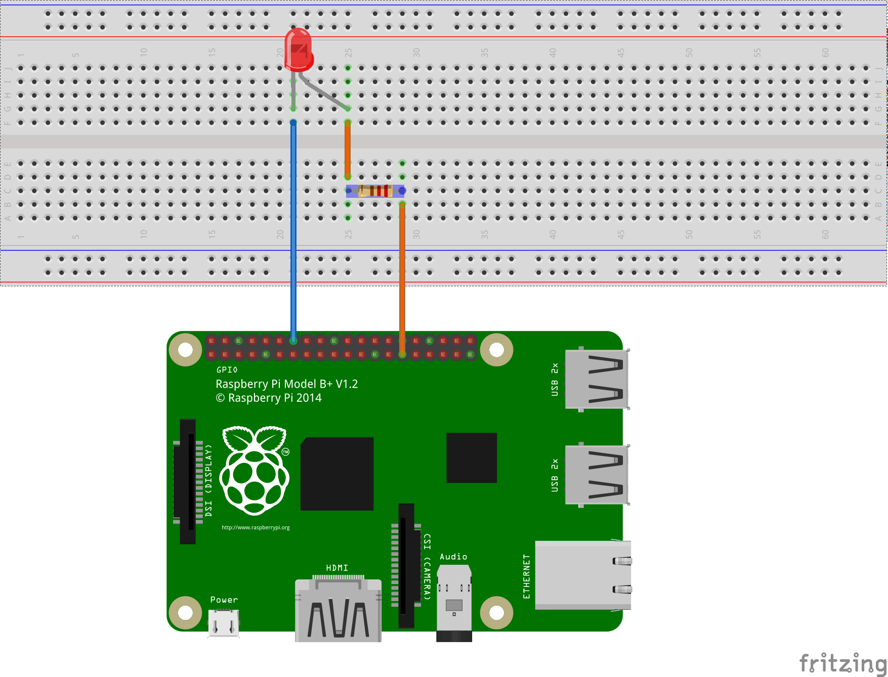

"# Android-Things-Mqtt-DEMO" 

If you are new to Anroid Things then I will recommend to go through the below mentioned links:
<ul>
<li><a href="https://developer.android.com/things/training/first-device/create-studio-project.html" target="_blank">Android Things Training</a>
</ul>

This repo contains demo application for using MQTT on android things via <b>"Eclipse Paho"</b> MQTT client.
In order to use the the project you will require:

<ul>
<li>Android Studio 2.2+
<li>Rasberry-Pi 3 with Android-Things installed.
<li>A bread-board.
<li>2 x jumper wires (female-to-male).
<li>A 633nm Led(Any color).
<li>A 220 ohm registor(optional).
</ul>

The following diagram shows configuration:
 

If you want to try the broker MQTT broker on your server/local machine, then you can opt for Mosquitto MQTT broker:
<ul>
<li><a href="http://www.eclipse.org/mosquitto/download/" target="_blank">Eclipse Mosquitto MQTT Broker</a>
</ul>
or can use any other broker supported by <b>"Eclipse Paho MQTT Client Library"</b>.

<b>NOTE:</b>
<blockquote> In order to use your own MQTT broker just change the 
 
BROKER_URL = "tcp://iot.eclipse.org:1883";
 
to 
 
BROKER_URL = "tcp://your.broker.url:here";
</blockquote>

For more details on MQTT you can check the below mentioned presentation on slide share:
<ul><li><a href="https://www.slideshare.net/PeterREgli/mq-telemetry-transport" tagret="_blank">Introduction to MQTT</a></ul>

You can use any of the third party MQTT client apps available on play store.for example:
<ul><li><a  href="https://play.google.com/store/apps/details?id=net.sabamiso.android.simplemqttviewer" target="_blank">
Simple MQTT Viewer</a></ul>

For more information on <b>"Eclipse Paho MQTT client"<b> please visit:
<ul><li><a  href="https://eclipse.org/paho/" target="_blank">
Eclipse Paho</a></ul>
